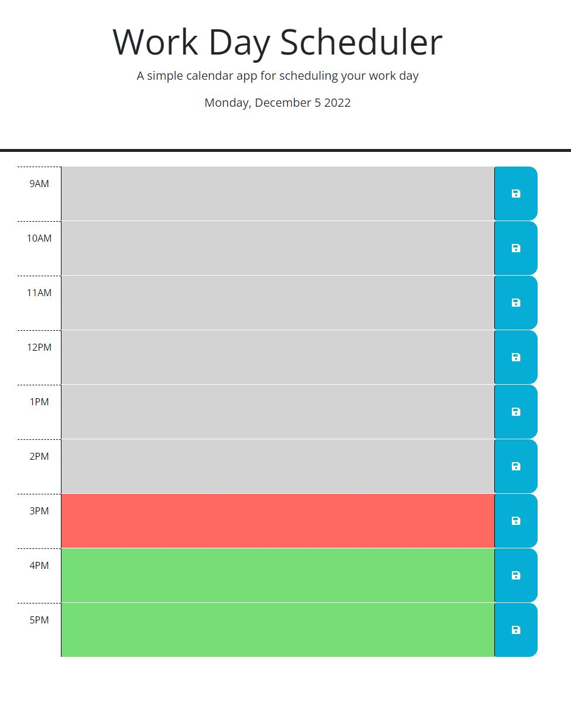

# DayPlanner 05 Challenge

## Description

Used source code to set up a daily planner where based on the current time. Time slots are shown to be in the past, present, or future.  Inputted data will be saved on local storage to save upon refreshed page.

## Links
[Portfoil Link](https://github.com/ThomasJay44/DayPlanner)

[Github](https://github.com/ThomasJay44)

## Screenshot

